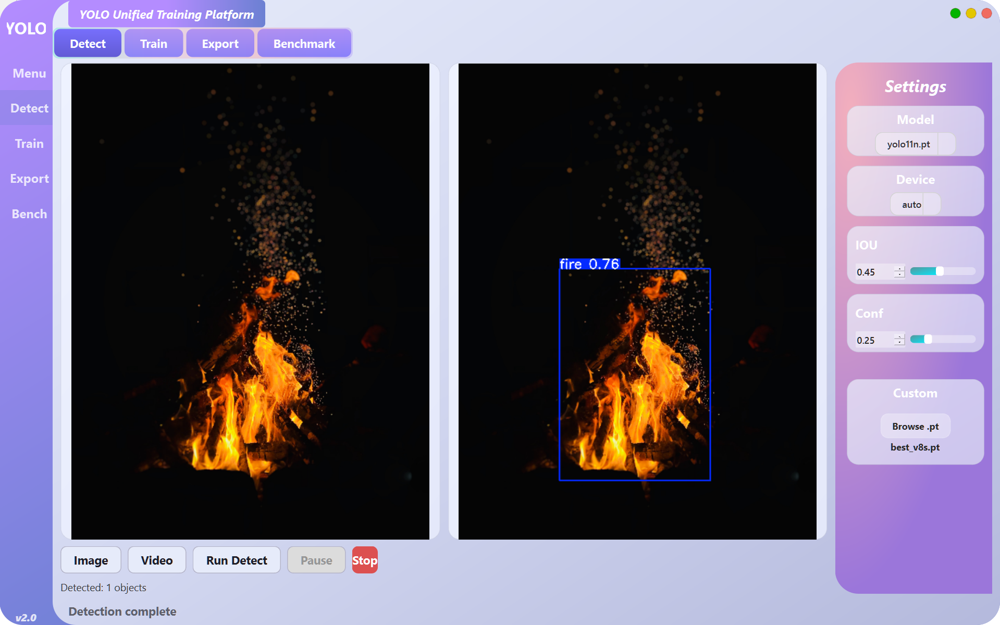
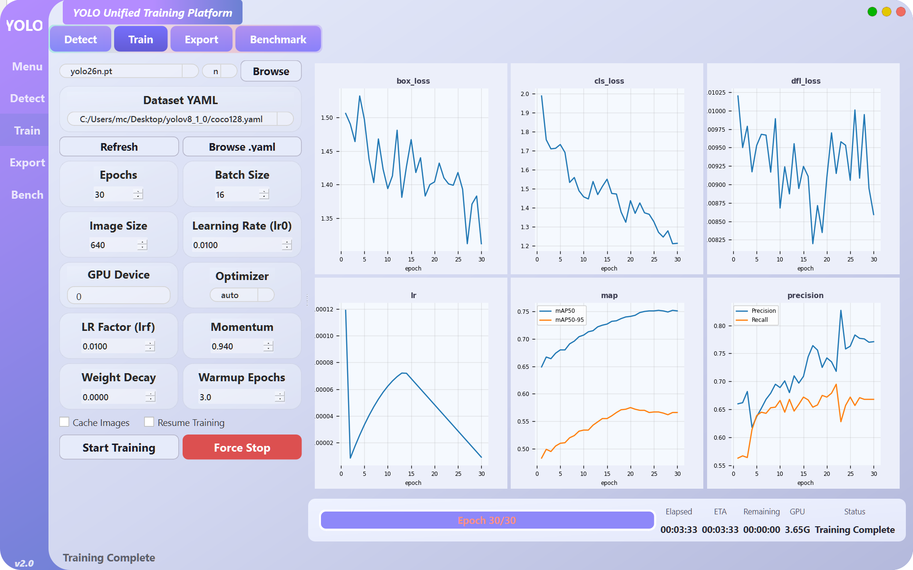

# 🚀 YOLO 统一训练平台

> **YOLOv5 / YOLOv8 / YOLOv10 / YOLOv11 / YOLO26 — 全系列统一框架**

一个基于 PySide6 的桌面 GUI 应用，支持 YOLO 全系列模型的检测、训练、导出和测速。

## 🎬 Demo

<video src="https://private-user-images.githubusercontent.com/147730960/616661193-ccde0869-2a89-457d-9ec8-08dc9b7f229b.mp4?jwt=eyJ0eXAiOiJKV1QiLCJhbGciOiJIUzI1NiJ9.eyJpc3MiOiJnaXRodWIuY29tIiwiYXVkIjoicmF3LmdpdGh1YnVzZXJjb250ZW50LmNvbSIsImtleSI6ImtleTUiLCJleHAiOjE3ODMwNTY4NDMsIm5iZiI6MTc4MzA1NjU0MywicGF0aCI6Ii8xNDc3MzA5NjAvNjE2NjYxMTkzLWNjZGUwODY5LTJhODktNDU3ZC05ZWM4LTA4ZGM5YjdmMjI5Yi5tcDQ_WC1BbXotQWxnb3JpdGhtPUFXUzQtSE1BQy1TSEEyNTYmWC1BbXotQ3JlZGVudGlhbD1BS0lBVkNPRFlMU0E1M1BRSzRaQSUyRjIwMjYwNzAzJTJGdXMtZWFzdC0xJTJGczMlMkZhd3M0X3JlcXVlc3QmWC1BbXotRGF0ZT0yMDI2MDcwM1QwNTI5MDNaJlgtQW16LUV4cGlyZXM9MzAwJlgtQW16LVNpZ25hdHVyZT01Zjg5MmY4NGU0NjczNTllNGU2MjFjNWYzMjFmNDhjNTJhOTYwNTg3YjA5YWU0MGZjMzJhOTdhZDg0YWZmOTY0JlgtQW16LVNpZ25lZEhlYWRlcnM9aG9zdCZyZXNwb25zZS1jb250ZW50LXR5cGU9dmlkZW8lMkZtcDQifQ.cTa7LihWne760NiFM_tuZ45ZcPsgdwNTj_0hW-m1aEQ" controls="controls" muted="muted" style="max-height:640px; min-height: 200px"></video>

---

## ✨ 功能特性

| 功能 | 说明 | 状态 |
|------|------|------|
| 🔍 图片/视频检测 | 支持暂停、停止、帧率同步 | ✅ |
| 🏋️ 模型训练 | 6 个实时图表 + Force Stop + 丰富参数 | ✅ |
| 📤 模型导出 | ONNX/TorchScript/TensorRT + shape 详情 | ✅ |
| ⚡ 速度测速 | PyTorch/ONNX 多后端对比 | ✅ |

---

## 📁 项目结构

```
yolo-unified-platform/
├── gui/                    # PySide6 桌面 GUI
│   ├── main_window.py     # 主窗口（4 个 Tab）
│   ├── workers.py         # 后台线程（推理/训练/导出/视频/测速）
│   ├── styles.py          # QSS 样式
│   └── settings.py        # 可调配置
├── benchmark/              # 速度测速
│   └── speed_benchmark.py # 多后端对比
├── ultralytics/            # 本地 ultralytics 源码副本
├── models/                 # 预训练模型权重
│   ├── yolov5n.pt
│   ├── yolov8n.pt
│   ├── yolov10n.pt
│   ├── yolo11n.pt
│   └── yolo26n.pt
├── docs/                   # 文档
│   ├── bugfix-log.md      # Bug 修复日志
│   └── 修改文档.md        # 代码修改记录
├── main_gui.py             # 启动入口
├── README.md
└── requirements.txt
```

---

## 🚀 快速开始

### 安装依赖

```bash
pip install -r requirements.txt
```

### 启动

```bash
python main_gui.py
```

---

## 🖥️ 桌面 GUI

### 四个 Tab 页面

| Tab | 功能 | 详情 |
|-----|------|------|
| **Detect** | 图片/视频检测 | 左侧输入，右侧结果，视频支持暂停/停止 |
| **Train** | 模型训练 | 6 个实时图表 + 进度条 + Force Stop + 丰富超参数 |
| **Export** | 模型导出 | 多格式导出 + opset/dynamic/simplify + shape 详情 |
| **Benchmark** | 速度测速 | PyTorch/ONNX 多后端对比，显示模型名称 |

### Detect 页面



- 支持图片和视频文件
- 视频逐帧检测，左右同步显示原视频和检测结果
- 支持暂停/继续/停止
- 可选帧率同步或实时检测速度
- 模型下拉框 + Browse 按钮选择自定义模型

### 训练页面



- **6 个实时图表**：box_loss、cls_loss、dfl_loss、lr、mAP（mAP50 + mAP50-95）、precision（Precision + Recall）
- **进度信息**：epoch 进度条、已用时间、预计剩余时间、GPU 显存
- **Force Stop**：batch 级别响应，自动保存并压缩模型（best.pt + last.pt）
- **GPU 内存管理**：训练结束自动释放显存

**模型选择**：
- 下拉框选择内置 `.pt` 模型
- `n/s/m/l/x` 缩放选择器（仅对 `.yaml` 架构文件生效）
- Browse 按钮可选择 `.pt` 或 `.yaml` 文件

**训练参数（2×3 网格）**：
- Epochs、Batch Size、Image Size
- Learning Rate (lr0)、GPU Device、Optimizer

**超参数（2×2 网格）**：
- LR Factor (lrf)、Momentum
- Weight Decay、Warmup Epochs

**其他选项**：Cache Images、Resume Training

### 配置文件

可调参数集中在 `gui/settings.py`，修改后重启生效：

```python
# gui/settings.py

# Loss 图表更新模式:
#   "epoch" — 每个 epoch 完成后画一个点（平滑，不抖动）
#   "batch" — 每个 batch 结束都更新当前点（实时，会抖动）
LOSS_UPDATE_MODE = "epoch"

# 视频检测帧率模式:
#   True  — 和原视频帧率对齐（播放速度 = 原视频速度）
#   False — 识别多快就多快（最快速度，不等待）
VIDEO_SYNC_FPS = False
```

### 导出页面

- **格式**：ONNX / TorchScript / TensorRT / TFLite / CoreML / Paddle
- **参数**：Image Size、ONNX Opset、FP16、Dynamic Batch、Simplify
- **导出详情**：input shape、output shape、文件大小、ONNX opset 版本
- Browse 按钮支持选择 `.pt` 或 `.yaml` 文件

### Benchmark 页面

- 测试 PyTorch 推理速度
- 输出包含模型名称、mean/std/min/max/median/p95/p99 延迟和 FPS
- Browse 按钮支持选择 `.pt` 或 `.yaml` 文件

---

## ⚡ Force Stop 机制

Force Stop 不是杀进程，而是设置 `trainer.stop = True` 标志，让 ultralytics 训练循环自己走完清理流程：

```
Force Stop → trainer.stop = True
    → 当前 batch 完成后 break
    → validate() + save_model()
    → final_eval() + strip_optimizer()
    → 释放 GPU 内存
    → 正常退出
```

**优势**：
- 模型文件完整（不会中途截断）
- 模型已压缩（optimizer state 被移除，~5.5MB 而非 ~11MB）
- best.pt 和 last.pt 都正确保存
- GPU 内存正确释放

---

## 📦 支持的 YOLO 版本

| 版本 | 文件名格式 | 预训练模型 | YAML 架构 |
|------|-----------|-----------|-----------|
| YOLOv5 | yolov5n/s/m/l/x.pt | ✅ | ✅ |
| YOLOv8 | yolov8n/s/m/l/x.pt | ✅ | ✅ |
| YOLOv10 | yolov10n/s/m/l/x/b.pt | ✅ | ✅ |
| YOLOv11 | yolo11n/s/m/l/x.pt | ✅ | ✅ |
| YOLO26 | yolo26n/s/m/l/x/c/e.pt | ✅ | ✅ |

---

## 📄 文档

- [代码修改记录](docs/修改文档.md)
- [Bug 修复日志](docs/bugfix-log.md)

---

## 📄 许可证

MIT License
